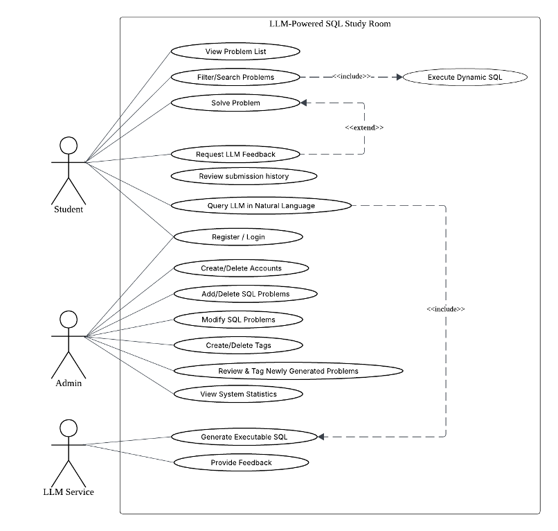
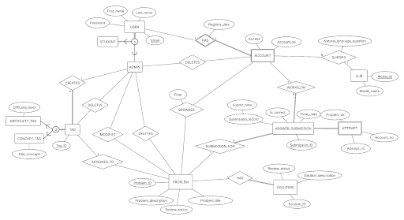
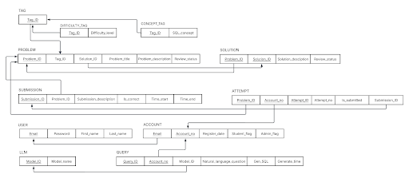
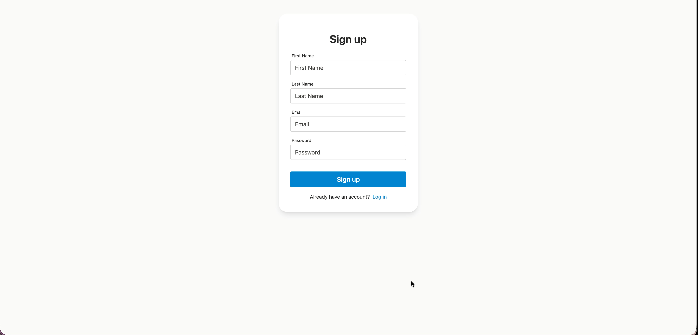
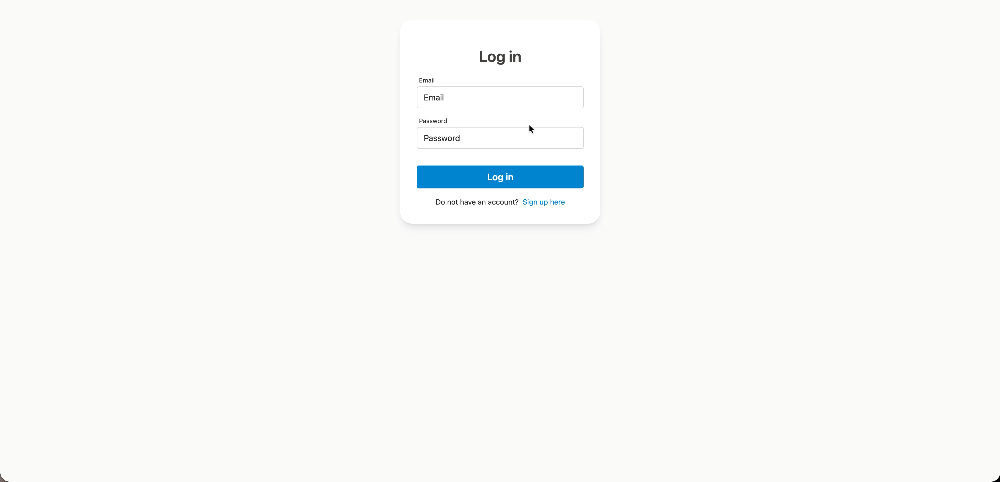
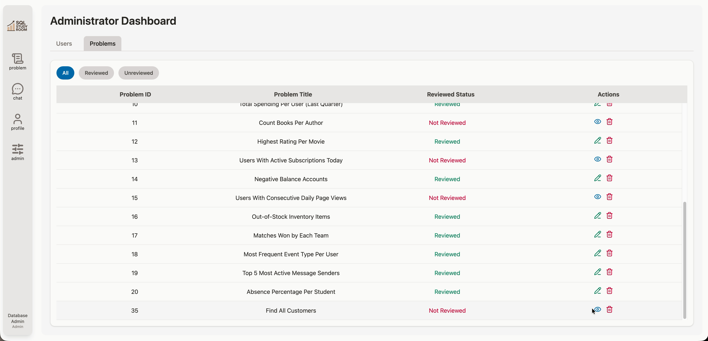

# Application Overview

**SQL Study Room** is a web application aims to support SQL learners with various SQL problems with an interactive AI-powered assistance which provide on-demand hints and real-time feedback. The frontend of the application uses React with Redux Toolkit, built with Vite for fast development. The backend is built with Django and Django REST Framework, providing structured API endpoints for all operations. All persistent data is stored in a MySQL database on Google Cloud SQL.
For deployment, we used Google Cloud Platform, hosting the backend on App Engine and connecting it to Cloud SQL. The application also integrated OpenAI API to support our AI Chat feature. This combination allowed our system to function like a production-ready SQL study platform with AI-assisted querying.

The application provides five main features:

1. Authentication: allows users to register and login
2. Problem Solving: view, filter, and solve SQL problems
3. User Profile: view and edit user information
4. Administrator Controls: review and publish SQL problems
5. AI Chat: dynamic query database based on user input

## Technologies

### Frontend (React + Redux Toolkit)

- The frontend handles all user interaction, page rendering, and routing. Pages such as problem browsing, submissions, and AI Chat interface are implemented here. Redux manages global states like login information.

### Backend API (Django + Django REST Framework)

- The backend exposes all API endpoints that the frontend relies on – login, retrieving problems, storing submissions, and executing database queries. For the AI Chat feature, the backend sends user questions to LLM and returns the generated SQL along with execution results.

### Database (MySQL on Cloud SQL)

- Application data, including accounts, user profiles, tags, problems, attempts, and submissions, is stored in a MySQL database. The backend interacts with this database directly for standard queries and also runs the SQL generated by the LLM.

### LLM Integration (OpenAI API)

- A key feature of our system is natural-language-to-SQL conversion. The backend provides the LLM with a structured prompt describing database schema and rules, and the model produces a safe SELECT query in response.

### Deployment (Google Cloud Platform)

- The backend is deployed on Google App Engine, while the database is hosted on Cloud SQL. The frontend communicates with the backend through HTTPS.

## Database Design

### Use Case Model

### EER Model

### Relational Model

## Application Demo

### Register

### Login

### Browse & Filter Problems

### Problem Workspace

### User Profile

### Administrator Dashboard: User

### Administrator Dashboard: Filter Problems

### Administrator Dashboard: Add Problems

### Administrator Dashboard: Publish Problems

### Administrator Dashboard: Edit Problems

